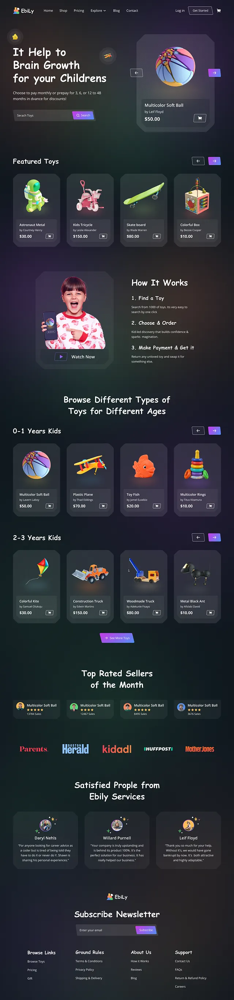

這份文件用來描述這個平台的技術規格。

本專案會製作一個網頁，支援以下裝置：
1. 手機
2. 平板

風格是：ui 參考.png

使用這樣的設計風格，並且抽取出重複使用的 component

清松手寫體 JasonHandwriting2-Regular.woff2 (要做字體壓縮，就是有用到再抽取出來，這樣載入才會快)

使用 React 加上 Tailwind，後端使用 Firebase。

圖片儲存使用 Firebase 的 Storage就可以了。至於這些圖片的角色，我稍後會去背再放進來。

希望進到關卡之後，角色會開始說話(題目)。說話的部分使用語音合成，而前面他會先自我介紹，唸自己的名字(名字的部分使用資料夾內的音檔，這部分我之後會裁切完畢，然後會唸題目出來)。  並且希望語音合成的聲音，會根據角色的設定而有不同的聲音

這個互動的題目，UI 必須都把它完成，並且依照這個「具體和關卡設定」所說的來完成